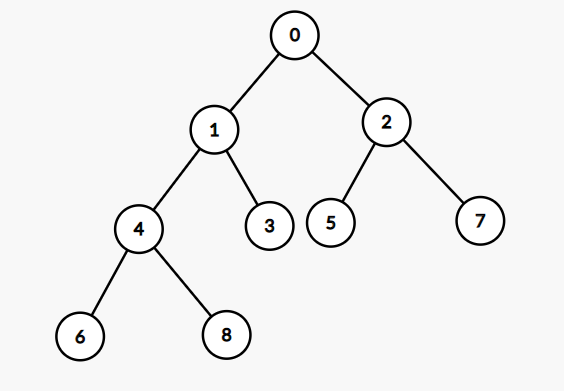

# 백준 11286: 절댓값 힙
_Code: 20220404, Comment: 20220404, Last Edit: -_

## 들어가는 말
 이런, 결국 스트릭을 놓치고 말았다! 오늘부터 다시 정신 붙들어매고 문제 풀이에 집중하자. 내일부터는 [AI배울랑교의 인공지능 교육 프로그램](https://www.baeulang.kr/bbs/board.php?bo_table=AI&wr_id=78&sca=%EA%B2%BD%EB%82%A8)에 참여하니, 0시 줄타기는 그만두고 여유시간 있을 때 미리 풀어놓자.

 오늘 해결한 문제는 간단한 힙 구현이다. 사실 이보다 더 간단한 문제로 [1927: 최소 힙](https://www.acmicpc.net/problem/1927)과 [11279: 최대 힙](https://www.acmicpc.net/problem/11279)이 있지만, 이미 풀었다는 점도 있고, 의도치 않게 거의 해답을 보게 된 문제라 올리기에는 석연치 않은 것도 있다. 그럼 힙에 대해 복습해보자.

## 본문

### 힙(heap)의 정의
 힙(heap)은 잎(leaf)이 아닌 모든 노드가 자식 노드와 서로 특정 대소 관계를 만족하는 완전 이진 트리(complete binary tree)다. 정렬 기준이 '크다'라면 그 힙은 최댓값 힙(maximum heap)이라 하고, '작다'라면 최소 힙(minimum heap)이라고 하는 식이다. 다음은 최소 힙의 예시이다.

 힙은 주어진 데이터 중 (정렬 기준이 주어져 있을 때) 가장 앞서는 데이터를 추출하는 데 유용한 자료구조다. 삽입과 삭제에서 힙 구조가 유지되도록 트리 구조가 조정되므로 힙의 정의에 의해 이 힙에서는 최솟값을 찾아오는 것이 매우 쉽다. 부모 노드가 곧 최솟값이기 때문이다.

 힙은 완전 이진 트리이다. 따라서 트리를 구현하기 위해 보편적으로 사용되는 재귀적 구조체가 아닌, 단순한 배열만으로 구현이 가능하다! 물론 배열을 임의로 조정하는 것은 안 되고, 스택(stack)이나 큐(queue)처럼 <code>push</code>와 <code>pop</code>만 가능하며, 약간의 알고리즘이 필요하다.
 
 이 문제에서의 정렬 기준은 <code>compareAbs()</code>이다.

### 힙을 구현하는 방법
힙의 노드를 배열에 저장하려 한다. 간단하게, 깊이(depth)가 낮은 순부터 '왼쪽에서 오른쪽'으로 읽으며 배열에 저장하자.

우선 0-base 언어라도 0번 인덱스는 사용하지 않는 것으로 약속하자. 이렇게 약속하면, <code>i</code>번 노드의 부모 노드는 <code>i/2</code>번 노드(나눗셈은 정수 나눗셈이다), 왼쪽과 오른쪽 자식 노드는 각각 <code>i&ast;2</code>번, <code>i&ast;2+1</code>번 노드라고 쉽게 계산할 수 있다! 이는 힙이 완전 이진 트리기 때문에 가능하다.

힙은 push와 pop이 이루어지더라도 힙의 구조를 유지해야 한다.
먼저 push를 위한 알고리즘을 나열하면 다음과 같다. 대소 관계는 편의상 '작다(&lt;)'로 설정하겠다. 최대 힙인 경우 반대로 하면 되고, 이 문제의 '절댓값 작다'의 경우도 마찬가지다.
* 일단 힙 배열의 마지막 원소 바로 뒤에 데이터를 저장한다.
* 힙 구조를 유지하기 위해 부모-자식을 서로 비교해 '부모<자식'이 아니라면 서로 바꾸고 다시 비교한다. 이는 방금 저장한 데이터가 루트(root)가 되거나, 조건을 만족할 때까지 반복한다.

그리고 pop의 알고리즘은 다음과 같다.
* pop할 원소는 무조건 뿌리 노드, 즉 <code>a[1]</code>이다! 그러나 후처리가 남아있으므로 임시 변수를 만들어 저장해두자.
* 마지막 원소, 즉 <code>a[heapsize]</code>를 새로운 뿌리 노드로 올린다. (중간 원소를 올린다면 또 처리 해야하므로...)
* push와는 반대로 조건을 만족할 때까지 자식과 바꿔 내려보낼 것이다. 이때 왼쪽 자식과 오른쪽 자식이 둘 다 더 작다면, 자식을 부모로 올린 후에도 나머지 자식보다 더 작아야하므로, 둘 중 더 작은 쪽을 선택한다.

필자는 <code>Heap</code> 클래스로 이를 구현했다.

## 나가는 말
 [18870: 좌표 압축](https://www.acmicpc.net/problem/18870)의 마지막 걸림돌을 제거할 방법을 알아냈다! 왜 이걸 생각하지 못했을까. 내일 문제는 반드시 이걸로 찾아오겠다.