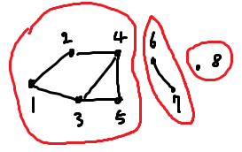

# 백준 11724: 연결 요소의 개수
_Code: 20220402, Comment: 20220402, Last Edit: -_

## 들어가는 말
 오늘도 어김없이 CLASS 3 문제를 들여보다 만만해보이는 실버 3 문제를 찾아서 풀려고 했다. [9095: 1, 2, 3 더하기](https://www.acmicpc.net/problem/9095)인데, 너무 간단한 문제였다. DP를 사용한다는 점이 없으면 브론즈로 내려가도 이상하지 않을 문제. 그래서 내친김에 DP에서 벗어나 오랜만에 그래프를 복습하기로 하였다.

## 본문

위 그림은 하나의 그래프다. 그래프에서 연결 요소(Connected Component)라는 것은 저 빨간 그룹의 수라고 간단하게 설명할 수 있다.

그럼 연결 요소를 구하는 방법은 간단하다.
* 어떤 정점(v)을 잡은 후, 탐색되어 있지 않았으면 그 점을 중심으로 탐색한다.

위 과정을 마치면 v가 포함된 연결 요소의 정점은 모두 탐색될 것이다.
이제 그래프에 있는 모든 정점을 v로 잡아 위 과정을 반복하기만 하면 된다.

그래프를 구현하는 방법은 인접 행렬(adjacency matrix), 인접 리스트(adjacency list), 결합 행렬(incidence matrix) 등이 있는데, 복잡하지 않은, 즉 희박한(sparce) 그래프에 대해서는 인접 리스트가 공간 효율적이다. 필자는 리스트의 역할로 <code>std::vector</code>를 사용하였다. 역시 만능이다.

## 나가는 말
 [18870: 좌표 압축](https://www.acmicpc.net/problem/18870)은 언제 정복할 수 있을까.