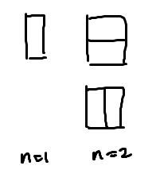
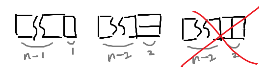

# 백준 11726: 2×n 타일링
_Code: 20220401, Comment: 20220401, Last Edit: -_

## 들어가는 말

 필자는 저번에 언급한대로 오늘 [18870: 좌표 압축](https://www.acmicpc.net/problem/18870) 문제를 풀려고 했으나, 아직 마지막 해법이 떠오르지 않아 급한대로 문제를 풀어 올린다. 단순한 DP 문제임에도 실버 III라는, 개인적인 소견으로 과대평가된 문제라고 생각한다.

## 본문

$n=1, 2$일때는 위 그림과 같이 쉽게 답이 $1, 2$이라는 것을 알아낼 수 있다.

$n > 2$일 때는 케이스를 위와 같이 나눠 구할 수 있다. 이때 3번째 케이스는 1번째 케이스의 일부와 겹치므로 세면 안 된다.

즉, 구하는 답을 $\left\{a_n\right\}$이라 하면 $\left\{a_n\right\}$은 다음의 점화식을 만족한다.
$$a_n = a_{n-1} + a_{n-2} \quad (n>2) \quad a_1 = 1, a_2 =2$$
어딘가 익숙해보인다. 일반항 부분은 피보나치 수열 $\left\{F_n\right\}$이고, 초항만 다른 형태다. 그러나 $a_1 = 1 = F_2, a_2 = 2 = F_3$이란 점에서 결국 $a_n = F_{n+1}$임을 알 수 있다.

피보나치 수열을 선형 시간 안에 구하는 것은 간단하므로 설명이 필요없다. 그러나 구하는 것은 이를 $10,007$로 나눈 수이므로, 구하는 과정에서 $10,007$로 나눈 나머지로 점화하면 될 뿐이다.

## 나가는 말
 내일은 꼭 풀고 만다.