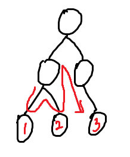
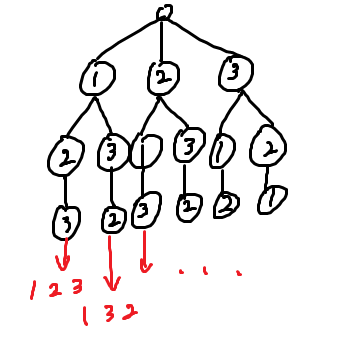
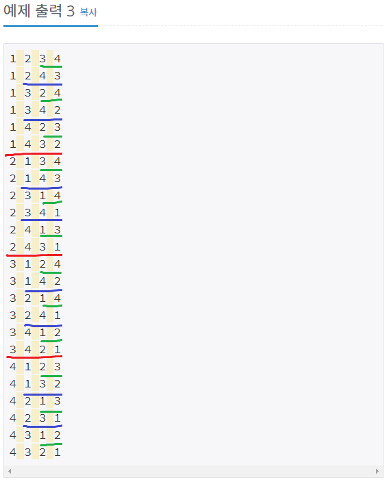

# 백준 15649: N과 M (1)
_Code: 20210801, Comment: 20220328, Last Edit: -_

## 들어가는 말

 오늘부터 GitHub에 1개 이상 PS를 한 후 해설을 올릴 것이다. 솔직히 잔디심기의 목적이 강하지만 무의미한 것보다는 최소한 낫지 않을까싶다. 아래는 오늘과 같이 다짐했었던 작년 8월 1일 [네이버 블로그](https://blog.naver.com/thesmartist)에 올린 해설이다. 아래는 그 내용이다. 어투가 다르지만 이번 해설에서만 무시해주길 바란다.

## 본문

 백트래킹(backtracking)은 위처럼 트리 구조의 알고리즘에서, 트리의 끝(leaf)에 도달했을 때 뒤로 돌아가 다른 경로를 탐색하는 방식의 알고리즘입니다. DFS(깊이 우선 탐색), BFS(너비 우선 탐색)이 대표적인 알고리즘입니다.

 이 문제도 백트래킹을 이용해야 풀 수 있는 문제였습니다. 위 그림처럼 나타내면 다음과 같다고 할 수 있습니다.

이제 본격적으로 문제를 풀기 위해선, 출력값이 나오기까지의 과정을 계층별로 나누는 작업이 필요합니다. 그래야 알고리즘을 트리 형태로 계층적으로 다룰 수 있으니깐요.

 입력으로 주어진 N과 M을 이용해 수열에 들어갈 수 있는 수의 리스트를 만들 수 있습니다. 리스트에서 수열에 들어갈 수를 '뽑는다'는 것은, 리스트에서 이 수를 없애고 출력값에 추가하는 것으로 구현할 수 있습니다. 단, 사전식으로 출력한다는 조건이 있으므로, 이는 작은 수부터 순서대로 진행되어야 합니다.

 사전 순서로 출력한다면, 가장 간단한 백트래킹 알고리즘인 DFS를 사용하면 됩니다. 수열의 첫 번째 원소가 될 수를 리스트에서 없애고, 없앤 리스트에서 두 번째를 없애고, 세 번째, 네 번째...와 같은 식으로 하다 끝에 가면 없앴던 모든 원소들을 한 번에 출력합니다. 그 후 한 단계 앞으로 돌아와 다른 수를 없애고, 출력하고, 돌아와 또 다른 수를 없애고... 이런 식으로 모든 없애는 경우를 다 출력하면 그 앞 단계로 다시 돌아와 위를 반복. 이런 식입니다.

 예시 입력 3을 예로 들어봅시다. 입력에 의해 출력될 수 있는 수의 리스트는 {1, 2, 3, 4}로 구했습니다. 이때 출력의 초반을 살펴봅시다.
​

 * 첫 번쨰로 1을 뽑으면 남은 리스트는 {2, 3, 4}, 출력값은 "1 "

 * 두 번째로 2을 뽑으면 남은 리스트는 {3, 4}, 출력값은 "1 2 "

 * 세 번째로 3을 뽑으면 남은 리스트는 {4}, 출력값은 "1 2 3 "

 * 네 번째의 리스트 크기는 1이기 때문에, 출력값에 "4\n"을 더하고 모두 출력합니다. 출력값은 "1 2 3 4\n".

 * 세 번쨰를 뽑았을 때로 돌아가 리스트에서 3 다음 원소인 4를 뽑습니다.

 * 네 번째의 리스트 크기는 1이기 때문에, 출력값에 "3\n"을 더하고 모두 출력합니다. 출력값은 "1 2 4 3\n".

 * 세 번쨰를 뽑았을 때로 돌아가 리스트에서 4 다음 원소를 출력하려 합니다. 없으므로 위로 올라갑니다.

 * 두 번쨰를 뽑았을 때로 돌아가 리스트에서 2 다음 원소인 3을 뽑습니다.

 * 세 번째로 2를 뽑으면 남은 리스트는 {4}, 출력값은 "1 3 2 "

 * 네 번째의 리스트 크기는 1이기 때문에, 출력값에 "4\n"을 더하고 모두 출력합니다. 출력값은 "1 3 2 4\n".

 * ...
​
 DFS는 재귀함수를 이용해 구현할 수 있습니다. 다만 문제를 해결하기 위해서, 현재 남은 리스트, 누적된 출력값, 그리고 리스트 중 M개만 뽑아 출력하는 것이기 때문에 앞으로 탐색할 깊이를 매개변수로 넘겨줘야 합니다. 각각 1부터 N까지의 리스트, 빈 문자열, M을 초기값으로 주면 되겠죠.

 코드는 위에서 말했던 것을 그대로 구현했습니다. 뽑을 수 있는 수 리스트는 원소를 제거하는 경우가 많으므로 C++ STL에서 지원하는 연결 리스트(linked list) 객체인 std::list를 사용했습니다. 또, 리스트에서 특정 수만 뽑는 과정은 따로 함수로 만들었습니다.

## 나가는 말
 리스트에서 원소들을 뽑지 않고 그대로 전달하도록 하면 [15651번: N과 M(3)](https://www.acmicpc.net/problem/15651)의 답이 됩니다.