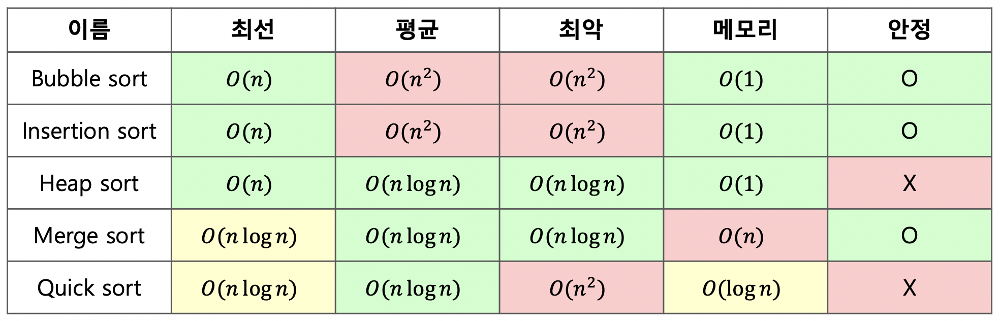

# 백준 18870: 좌표 압축
_Code: 20220407, Comment: 20220407, Last Edit: -_

## 들어가는 말

 드디어 좌표 압축을 정복하는 데 성공했다. 동시에 정렬 알고리즘에 대해 부족한 지식이 드러난 것 같아 한 편으로는 부끄럽기도 하다. 그런 의미에서 정렬에 대한 개념을 복습하고 가자.

 컴퓨터공학의 세계에는 데이터를 정렬하기 위한 알고리즘만 수 없이 많다. 데이터가 정렬되어 있다면 **이진 탐색**이라는 강력한 탐색 알고리즘을 사용할 수 있기 때문이다. 아래는 그 중 유명한 알고리즘과 그의 최선, 평균, 최악 시간복잡도, 그리고 공간복잡도다.

 여기서 안정 정렬(stable sort)이란, 두 데이터의 키값(비교하는 값)이 같을 때 원래의 순서를 유지하는 정렬이다. 그러나 이번 문제에서는 딱히 고려할 필요는 없다.

 $1 \leq N \leq 1,000,000$ 이란 조건이 있고, 컴퓨터는 1초에 1억 번 연산할 수 있다는 암묵적인 추산이 있으니, 어떠한 경우에도 시간복잡도는 $O(N^2)$ 이상이면 안 될 것이다. 즉, 최악의 경우에 시간복잡도가 $O(N^2)$인 빠른 정렬(Quick sort)는 사용할 수 없다! 이 사실을 까먹은 바람에 며칠을 헤맸는지 모르겠다. 부랴부랴 힙 정렬(Heap sort)로 바꾸니 거짓말처럼 문제가 해결됐던 것이다. 어쩌면 저번에 [11286번: 절댓값 힙 문제를 풀었던](https://github.com/DoubleDeltas/PS-Streak/tree/main/boj_11286) 것은 오늘을 위한 예지였을지도 모르겠다.

 회탄은 이만하고, 필자가 문제를 해결한 방법을 소개하겠다.

## 본문

힙 정렬(Heap sort)의 원리는 간단하다. 힙이 무엇인가. 아무렇게나 push해도 pop을 하면 **상수 시간**에 최솟값(최댓값)을 찾아주는 사기적인 자료구조가 아닌가! 고로 여기다 모든 데이터를 넣은 뒤, 넣은 만큼 뽑아서 다시 나열해주기만 하면 모든 데이터가 정렬된다!

그럼 재배열된 순서는 어떻게 알 수 있을까? 한 가지 방법은 데이터를 힙에 넣기 전, 그 데이터를 입력받은 순서를 쌍으로 묶어 같이 집어넣는 것이다. 힙에서 꺼내온 후 재배열되었을 때, 데이터의 순서를 다시 순서대로 읽으면 우리가 구하는 답이 될 수도 있다.

그러나 값이 다른 데이터가 여러 개 들어왔을 때 이는 문제가 된다. 값이 같을 때 순위는 같아야 하는데, 위의 방식으로는 구현할 수 없다.

또 하나의 방법은, 중복값을 제거한 데이터들을 순서대로 나열하여 '순위표'를 만드는 것이다. 만들어진 순위표에서 처음 입력받은 데이터들을 차례차례 검색하면, 그에 해당하는 순위가 나올 것이다. 앞서 언급했듯, 정렬된 데이터에 대해서는 **이진 탐색**이라는 강력한 탐색 알고리즘을 사용할 수 있으니, 실행 시간에는 전혀 문제가 없다!

이 아이디어를 코드로 구현한 것이 필자의 해답이다.

## 나가는 말

 기나긴 여정에 마침표를 찍으니 후련섭섭한 기분이다. 내일부터는 새로운 문제로 찾아오겠다.